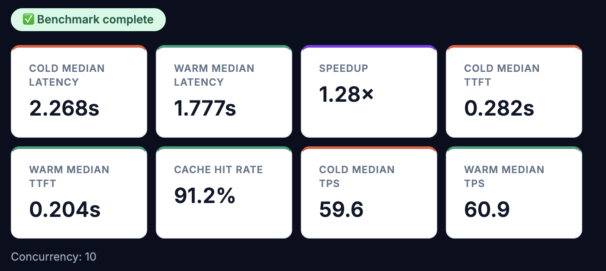
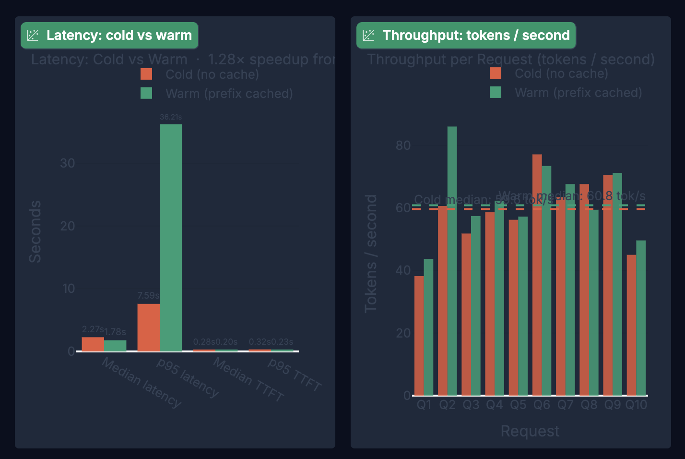
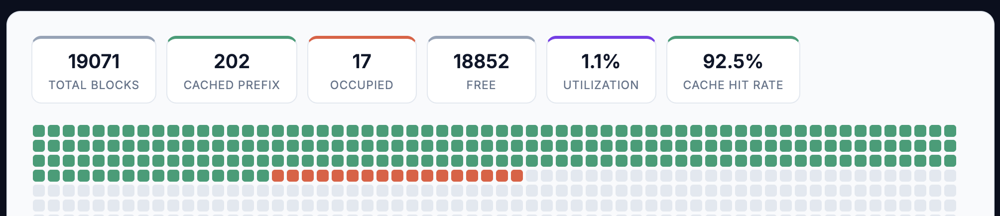

# PagedQA

Document Q&A powered by [vLLM](https://github.com/vllm-project/vllm) with **prefix caching**. Upload a PDF or text file, ask questions against it, and benchmark the latency speedup from KV cache reuse.

## Results

Benchmarked on a **T4 GPU** (Google Colab) with `Qwen/Qwen2.5-1.5B-Instruct`, concurrency 10:







| Metric | Value |
|---|---|
| Cold median latency | 2.268s |
| Warm median latency | 1.777s |
| **Speedup** | **1.28×** |
| Cold TTFT | 0.282s |
| Warm TTFT | 0.204s |
| **Cache hit rate** | **91.2%** |

## How it works

Every question sent to the same document shares an identical prompt prefix — the system message + document text. vLLM's prefix caching stores those KV blocks on the GPU after the first request, so subsequent questions skip recomputing them entirely. The benchmark tab measures the difference between cold (no cache) and warm (cached) conditions.

## Features

- **Upload** — ingest PDF or `.txt`/`.md` files; get a `doc_id` for further use
- **Ask** — stream answers against an uploaded document with live latency display
- **Benchmark** — run concurrent cold vs warm requests and visualize the speedup with Plotly charts
- **Memory** — live KV block visualization showing cached prefix, occupied, and free blocks; refreshes after every query

## Run on Google Colab

1. Open a new notebook and set runtime to **T4 GPU** (Runtime → Change runtime type)
2. Upload all `.py` files or clone the repo
3. Install dependencies:
```python
!pip install "vllm>=0.4.0,<0.8.0" "transformers>=4.40.0,<4.47.0" "gradio>=4.0.0" "pdfplumber>=0.10.0" "plotly>=5.0.0"
```
4. Start the app in the background:
```python
!python app.py > app.log 2>&1 &
```
5. Check the log for the public Gradio URL:
```python
!grep -i "running on" app.log
```

## Local setup

```bash
pip install -r requirements.txt
python app.py
```

Requires a CUDA GPU. Opens on port `7860` with a public `gradio.live` share link.

## Configuration

Edit `EngineConfig` in [engine.py](engine.py):

| Field | Default | Description |
|---|---|---|
| `model` | `Qwen/Qwen2.5-1.5B-Instruct` | vLLM model to load |
| `enable_prefix_caching` | `True` | Toggle KV cache prefix reuse |
| `gpu_memory_utilization` | `0.90` | Fraction of GPU VRAM for KV cache |
| `max_new_tokens` | `None` | Max tokens per answer (None = until stop token) |
| `dtype` | `float16` | Use `float16` for T4 (compute capability 7.5) |
| `tensor_parallel_size` | `1` | Number of GPUs |

## Project structure

```
app.py        — Gradio UI (4 tabs: Upload, Ask, Benchmark, Memory)
engine.py     — vLLM AsyncLLMEngine singleton + streaming + stats
document.py   — File ingestion, text extraction, prompt builder, in-memory store
benchmark.py  — Cold vs warm benchmark runner with concurrent request support
charts.py     — Plotly figures: latency, throughput, cache hit rate
```

## Dependencies

- `vllm >= 0.4.0, < 0.8.0`
- `transformers >= 4.40.0, < 4.47.0`
- `gradio >= 4.0.0`
- `pdfplumber >= 0.10.0`
- `plotly >= 5.0.0`
